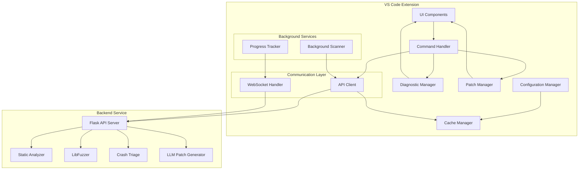
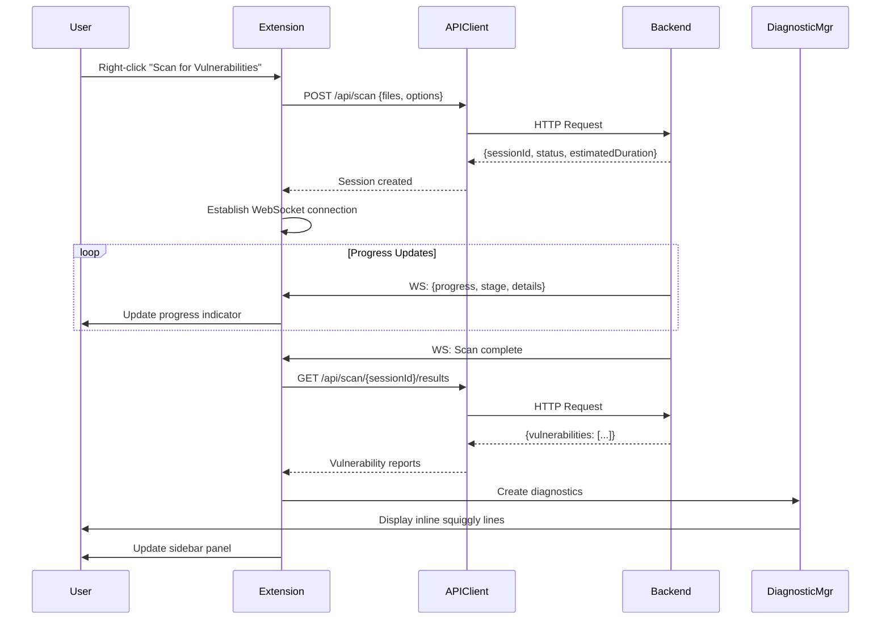
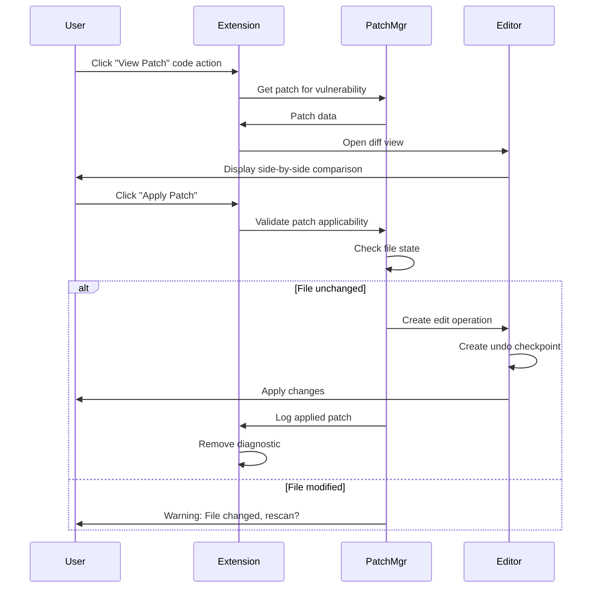

# Design Document: VS Code AutoVulRepair Extension

## Overview

### Purpose

The VS Code AutoVulRepair Extension integrates automated vulnerability detection and repair capabilities directly into the developer's IDE. It provides a seamless interface to the AutoVulRepair backend service, enabling C/C++ developers to identify, analyze, and fix security vulnerabilities without leaving their coding environment.

### Key Features

- Context menu-driven vulnerability scanning for files and folders
- Real-time inline diagnostics with severity-based visual indicators
- Dedicated sidebar panel for vulnerability management and filtering
- Automated background scanning on file save with configurable debouncing
- One-click patch preview and application with diff view
- Real-time progress updates via WebSocket for long-running scans
- Fuzzing campaign integration with crash triage results
- Comprehensive configuration management through VS Code settings
- Robust error handling with circuit breaker pattern and fallback mechanisms

### Architecture Philosophy

The extension follows a layered architecture with clear separation of concerns:
- **Presentation Layer**: VS Code UI components (diagnostics, sidebar, diff view)
- **Business Logic Layer**: Scan orchestration, patch management, state management
- **Communication Layer**: REST API client and WebSocket handler
- **Data Layer**: Caching, persistence, and state storage

This design prioritizes responsiveness, reliability, and user experience while maintaining clean integration with the existing AutoVulRepair backend infrastructure.

## Architecture

### System Architecture Diagram



### Component Breakdown

#### 1. Extension Activation and Lifecycle
- **Activation Events**: Triggered on C/C++ file open, workspace contains C/C++ files, or explicit command invocation
- **Initialization**: Registers commands, creates sidebar view, initializes API client, loads configuration
- **Deactivation**: Closes WebSocket connections, flushes cache, disposes of diagnostics

#### 2. UI Components

**Diagnostic Manager**
- Creates and manages VS Code diagnostic collections
- Maps vulnerability severity to diagnostic severity
- Provides code actions for patch viewing and application
- Persists diagnostics across file close/reopen

**Sidebar Panel (TreeView)**
- Displays hierarchical vulnerability list grouped by file
- Provides filtering by severity and search functionality
- Shows vulnerability count badges
- Handles navigation to vulnerability locations

**Diff View**
- Renders side-by-side comparison of original and patched code
- Highlights modified lines
- Provides "Apply Patch" action button

**Progress Indicator**
- Status bar item for background scans
- Modal progress for user-initiated scans
- Displays scan stage and percentage
- Provides cancellation capability

#### 3. Communication Layer

**API Client**
- REST API communication with configurable base URL
- Request/response serialization and validation
- Retry logic with exponential backoff
- Timeout management (30s for initiation, 300s for results)
- Circuit breaker pattern for fault tolerance

**WebSocket Handler**
- Establishes persistent connection for progress updates
- Handles reconnection with fallback to polling
- Parses and dispatches progress messages
- Manages connection lifecycle per scan session

#### 4. Business Logic Components

**Background Scanner**
- Monitors file save events for C/C++ files
- Implements debouncing to avoid excessive scans
- Respects file size limits and exclusion patterns
- Queues scans when concurrent limit is reached

**Patch Manager**
- Validates patch applicability to current file state
- Creates VS Code edit operations for patch application
- Manages undo checkpoints
- Logs applied patches for audit trail

**Configuration Manager**
- Reads and writes VS Code workspace settings
- Validates configuration values
- Provides reactive updates when settings change
- Manages secure storage for authentication tokens

**Cache Manager**
- In-memory cache for vulnerability reports
- Invalidation on file modification
- LRU eviction policy for memory management
- Persistence of scan results across sessions

### Data Flow Diagrams

#### Scan Workflow



#### Patch Application Workflow



### Technology Stack

**Core Technologies**
- **Language**: TypeScript 5.0+
- **Runtime**: Node.js 18+
- **Framework**: VS Code Extension API 1.75.0+

**Key Dependencies**
- `vscode`: VS Code extension API
- `axios`: HTTP client for REST API communication
- `ws`: WebSocket client for real-time updates
- `glob`: File pattern matching for exclusions
- `diff`: Patch generation and validation

**Development Tools**
- `@types/vscode`: TypeScript definitions for VS Code API
- `eslint`: Code linting
- `prettier`: Code formatting
- `jest`: Unit testing framework
- `fast-check`: Property-based testing library
- `vscode-test`: Integration testing utilities

## Components and Interfaces

### Extension Entry Point

```typescript
// extension.ts
export function activate(context: vscode.ExtensionContext): void {
  // Initialize configuration
  const config = new ConfigurationManager(context);
  
  // Initialize API client
  const apiClient = new APIClient(config);
  
  // Initialize managers
  const diagnosticManager = new DiagnosticManager();
  const patchManager = new PatchManager(diagnosticManager);
  const cacheManager = new CacheManager(context);
  
  // Initialize UI components
  const sidebarProvider = new VulnerabilitySidebarProvider(diagnosticManager);
  const progressTracker = new ProgressTracker();
  
  // Initialize background scanner
  const backgroundScanner = new BackgroundScanner(
    apiClient,
    diagnosticManager,
    config,
    cacheManager
  );
  
  // Register commands
  registerCommands(context, apiClient, diagnosticManager, patchManager, config);
  
  // Register sidebar
  vscode.window.registerTreeDataProvider('autoVulRepairSidebar', sidebarProvider);
  
  // Register event listeners
  registerEventListeners(context, backgroundScanner, config);
}

export function deactivate(): void {
  // Cleanup resources
}
```


### API Client

```typescript
// apiClient.ts
export interface ScanRequest {
  files: Array<{
    path: string;
    content: string;
  }>;
  options: {
    staticAnalysis: boolean;
    fuzzing: boolean;
  };
}

export interface ScanResponse {
  sessionId: string;
  status: string;
  estimatedDuration: number;
}

export interface ScanStatusResponse {
  status: string;
  progress: number;
  stage: string;
}

export interface VulnerabilityReport {
  file: string;
  line: number;
  column: number;
  severity: 'Critical' | 'High' | 'Medium' | 'Low' | 'Info';
  type: string;
  description: string;
  exploitabilityScore?: number;
  patch?: string;
}

export interface ScanResultsResponse {
  vulnerabilities: VulnerabilityReport[];
}

export class APIClient {
  private baseURL: string;
  private timeout: { initiation: number; results: number };
  private maxRetries: number;
  private circuitBreaker: CircuitBreaker;
  
  constructor(config: ConfigurationManager) {
    this.baseURL = config.get('backendURL', 'http://localhost:5000');
    this.timeout = { initiation: 30000, results: 300000 };
    this.maxRetries = 3;
    this.circuitBreaker = new CircuitBreaker(5, 60000);
  }
  
  async scan(request: ScanRequest): Promise<ScanResponse> {
    return this.circuitBreaker.execute(() =>
      this.retryRequest(() =>
        axios.post<ScanResponse>(`${this.baseURL}/api/scan`, request, {
          timeout: this.timeout.initiation,
          headers: this.getHeaders(),
        })
      )
    );
  }
  
  async getScanStatus(sessionId: string): Promise<ScanStatusResponse> {
    return this.retryRequest(() =>
      axios.get<ScanStatusResponse>(
        `${this.baseURL}/api/scan/${sessionId}/status`,
        { timeout: this.timeout.initiation, headers: this.getHeaders() }
      )
    );
  }
  
  async getScanResults(sessionId: string): Promise<ScanResultsResponse> {
    return this.retryRequest(() =>
      axios.get<ScanResultsResponse>(
        `${this.baseURL}/api/scan/${sessionId}/results`,
        { timeout: this.timeout.results, headers: this.getHeaders() }
      )
    );
  }
  
  async cancelScan(sessionId: string): Promise<void> {
    await axios.delete(`${this.baseURL}/api/scan/${sessionId}`, {
      headers: this.getHeaders(),
    });
  }
  
  private async retryRequest<T>(
    fn: () => Promise<AxiosResponse<T>>
  ): Promise<T> {
    // Exponential backoff retry logic
  }
  
  private getHeaders(): Record<string, string> {
    const headers: Record<string, string> = {
      'Content-Type': 'application/json',
      'User-Agent': `AutoVulRepair-VSCode/${getExtensionVersion()}`,
    };
    
    const token = this.config.getSecure('authToken');
    if (token) {
      headers['Authorization'] = `Bearer ${token}`;
    }
    
    return headers;
  }
}
```


### WebSocket Handler

```typescript
// websocketHandler.ts
export interface ProgressMessage {
  progress: number;
  stage: string;
  details: string;
}

export class WebSocketHandler {
  private ws: WebSocket | null = null;
  private reconnectAttempts = 0;
  private maxReconnectAttempts = 3;
  private fallbackToPolling = false;
  
  constructor(
    private sessionId: string,
    private baseURL: string,
    private onProgress: (message: ProgressMessage) => void,
    private onComplete: () => void,
    private onError: (error: Error) => void
  ) {}
  
  connect(): void {
    const wsURL = this.baseURL.replace('http', 'ws');
    this.ws = new WebSocket(
      `${wsURL}/api/scan/${this.sessionId}/progress`
    );
    
    this.ws.on('open', () => {
      this.reconnectAttempts = 0;
    });
    
    this.ws.on('message', (data: string) => {
      try {
        const message: ProgressMessage = JSON.parse(data);
        this.onProgress(message);
        
        if (message.progress >= 100) {
          this.onComplete();
          this.close();
        }
      } catch (error) {
        this.onError(new Error('Failed to parse progress message'));
      }
    });
    
    this.ws.on('error', (error) => {
      if (this.reconnectAttempts < this.maxReconnectAttempts) {
        this.reconnect();
      } else {
        this.fallbackToPolling = true;
        this.onError(error);
      }
    });
    
    this.ws.on('close', () => {
      if (!this.fallbackToPolling && this.reconnectAttempts < this.maxReconnectAttempts) {
        this.reconnect();
      }
    });
  }
  
  private reconnect(): void {
    this.reconnectAttempts++;
    setTimeout(() => this.connect(), 1000 * this.reconnectAttempts);
  }
  
  close(): void {
    if (this.ws) {
      this.ws.close();
      this.ws = null;
    }
  }
  
  shouldFallbackToPolling(): boolean {
    return this.fallbackToPolling;
  }
}
```


### Diagnostic Manager

```typescript
// diagnosticManager.ts
export class DiagnosticManager {
  private diagnosticCollection: vscode.DiagnosticCollection;
  private vulnerabilityMap: Map<string, VulnerabilityReport[]>;
  
  constructor() {
    this.diagnosticCollection = vscode.languages.createDiagnosticCollection(
      'autoVulRepair'
    );
    this.vulnerabilityMap = new Map();
  }
  
  createDiagnostics(
    fileUri: vscode.Uri,
    vulnerabilities: VulnerabilityReport[]
  ): void {
    this.vulnerabilityMap.set(fileUri.fsPath, vulnerabilities);
    
    const diagnostics = vulnerabilities.map((vuln) =>
      this.createDiagnostic(vuln)
    );
    
    this.diagnosticCollection.set(fileUri, diagnostics);
  }
  
  private createDiagnostic(vuln: VulnerabilityReport): vscode.Diagnostic {
    const range = new vscode.Range(
      vuln.line - 1,
      vuln.column,
      vuln.line - 1,
      vuln.column + 1
    );
    
    const diagnostic = new vscode.Diagnostic(
      range,
      this.formatMessage(vuln),
      this.mapSeverity(vuln.severity)
    );
    
    diagnostic.source = 'AutoVulRepair';
    diagnostic.code = vuln.type;
    
    return diagnostic;
  }
  
  private mapSeverity(
    severity: VulnerabilityReport['severity']
  ): vscode.DiagnosticSeverity {
    switch (severity) {
      case 'Critical':
      case 'High':
        return vscode.DiagnosticSeverity.Error;
      case 'Medium':
        return vscode.DiagnosticSeverity.Warning;
      case 'Low':
      case 'Info':
        return vscode.DiagnosticSeverity.Information;
    }
  }
  
  private formatMessage(vuln: VulnerabilityReport): string {
    let message = `[${vuln.severity}] ${vuln.type}: ${vuln.description}`;
    if (vuln.exploitabilityScore !== undefined) {
      message += ` (Exploitability: ${vuln.exploitabilityScore}/10)`;
    }
    return message;
  }
  
  getVulnerability(
    fileUri: vscode.Uri,
    line: number
  ): VulnerabilityReport | undefined {
    const vulnerabilities = this.vulnerabilityMap.get(fileUri.fsPath);
    return vulnerabilities?.find((v) => v.line === line + 1);
  }
  
  clearDiagnostics(fileUri?: vscode.Uri): void {
    if (fileUri) {
      this.diagnosticCollection.delete(fileUri);
      this.vulnerabilityMap.delete(fileUri.fsPath);
    } else {
      this.diagnosticCollection.clear();
      this.vulnerabilityMap.clear();
    }
  }
  
  getAllVulnerabilities(): Map<string, VulnerabilityReport[]> {
    return new Map(this.vulnerabilityMap);
  }
  
  dispose(): void {
    this.diagnosticCollection.dispose();
  }
}
```


### Patch Manager

```typescript
// patchManager.ts
export interface PatchApplication {
  fileUri: vscode.Uri;
  vulnerability: VulnerabilityReport;
  timestamp: Date;
  success: boolean;
}

export class PatchManager {
  private patchHistory: PatchApplication[] = [];
  
  constructor(private diagnosticManager: DiagnosticManager) {}
  
  async showPatchPreview(
    fileUri: vscode.Uri,
    vulnerability: VulnerabilityReport
  ): Promise<void> {
    if (!vulnerability.patch) {
      vscode.window.showErrorMessage('No patch available for this vulnerability');
      return;
    }
    
    const document = await vscode.workspace.openTextDocument(fileUri);
    const originalContent = document.getText();
    const patchedContent = this.applyPatchToContent(
      originalContent,
      vulnerability
    );
    
    // Create temporary document for diff view
    const tempUri = fileUri.with({ scheme: 'autoVulRepair-patch' });
    const tempDocument = await vscode.workspace.openTextDocument(
      tempUri.with({ query: patchedContent })
    );
    
    await vscode.commands.executeCommand(
      'vscode.diff',
      fileUri,
      tempUri,
      `Patch Preview: ${vulnerability.type}`
    );
  }
  
  async applyPatch(
    fileUri: vscode.Uri,
    vulnerability: VulnerabilityReport
  ): Promise<boolean> {
    if (!vulnerability.patch) {
      return false;
    }
    
    const document = await vscode.workspace.openTextDocument(fileUri);
    
    // Validate file hasn't changed since scan
    if (!this.validatePatchApplicability(document, vulnerability)) {
      const rescan = await vscode.window.showWarningMessage(
        'File has been modified since scan. Rescan before applying patch?',
        'Rescan',
        'Cancel'
      );
      
      if (rescan === 'Rescan') {
        // Trigger rescan
        return false;
      }
      return false;
    }
    
    const edit = new vscode.WorkspaceEdit();
    const range = this.getPatchRange(document, vulnerability);
    edit.replace(fileUri, range, vulnerability.patch);
    
    const success = await vscode.workspace.applyEdit(edit);
    
    if (success) {
      this.diagnosticManager.clearDiagnostics(fileUri);
      this.logPatchApplication(fileUri, vulnerability, true);
    }
    
    return success;
  }
  
  private validatePatchApplicability(
    document: vscode.TextDocument,
    vulnerability: VulnerabilityReport
  ): boolean {
    // Check if the line content matches expected pre-patch state
    const line = document.lineAt(vulnerability.line - 1);
    // Implementation would compare with stored original content
    return true;
  }
  
  private getPatchRange(
    document: vscode.TextDocument,
    vulnerability: VulnerabilityReport
  ): vscode.Range {
    // Parse patch to determine affected range
    const startLine = vulnerability.line - 1;
    const endLine = startLine + 1; // Simplified, would parse patch for actual range
    return new vscode.Range(
      startLine,
      0,
      endLine,
      document.lineAt(endLine).text.length
    );
  }
  
  private applyPatchToContent(
    content: string,
    vulnerability: VulnerabilityReport
  ): string {
    // Apply patch using diff library
    return content; // Simplified
  }
  
  private logPatchApplication(
    fileUri: vscode.Uri,
    vulnerability: VulnerabilityReport,
    success: boolean
  ): void {
    this.patchHistory.push({
      fileUri,
      vulnerability,
      timestamp: new Date(),
      success,
    });
    
    // Log to output channel
    console.log(
      `[${new Date().toISOString()}] Applied patch for ${vulnerability.type} in ${fileUri.fsPath}`
    );
  }
  
  getPatchHistory(): PatchApplication[] {
    return [...this.patchHistory];
  }
}
```


### Background Scanner

```typescript
// backgroundScanner.ts
export class BackgroundScanner {
  private scanQueue: Map<string, NodeJS.Timeout> = new Map();
  private activeScanSessions: Set<string> = new Set();
  private maxConcurrentScans: number;
  
  constructor(
    private apiClient: APIClient,
    private diagnosticManager: DiagnosticManager,
    private config: ConfigurationManager,
    private cacheManager: CacheManager
  ) {
    this.maxConcurrentScans = config.get('maxConcurrentScans', 3);
  }
  
  onFileSave(document: vscode.TextDocument): void {
    if (!this.shouldScan(document)) {
      return;
    }
    
    const filePath = document.uri.fsPath;
    
    // Clear existing debounce timer
    const existingTimer = this.scanQueue.get(filePath);
    if (existingTimer) {
      clearTimeout(existingTimer);
    }
    
    // Set new debounce timer
    const delay = this.config.get('backgroundScanDelay', 2000);
    const timer = setTimeout(() => {
      this.scanQueue.delete(filePath);
      this.enqueueScan(document);
    }, delay);
    
    this.scanQueue.set(filePath, timer);
  }
  
  private shouldScan(document: vscode.TextDocument): boolean {
    // Check if background scanning is enabled
    if (!this.config.get('backgroundScanEnabled', false)) {
      return false;
    }
    
    // Check file extension
    const ext = path.extname(document.fileName);
    if (!['.c', '.cpp', '.cc', '.cxx', '.h', '.hpp'].includes(ext)) {
      return false;
    }
    
    // Check file size limit
    const maxSize = this.config.get('maxFileSizeKB', 1024) * 1024;
    if (document.getText().length > maxSize) {
      return false;
    }
    
    // Check exclusion patterns
    const exclusions = this.config.get<string[]>('excludePatterns', []);
    const relativePath = vscode.workspace.asRelativePath(document.uri);
    if (exclusions.some((pattern) => minimatch(relativePath, pattern))) {
      return false;
    }
    
    return true;
  }
  
  private async enqueueScan(document: vscode.TextDocument): Promise<void> {
    const filePath = document.uri.fsPath;
    
    // Check if already scanning
    if (this.activeScanSessions.has(filePath)) {
      return;
    }
    
    // Check concurrent scan limit
    if (this.activeScanSessions.size >= this.maxConcurrentScans) {
      // Queue for later
      setTimeout(() => this.enqueueScan(document), 5000);
      return;
    }
    
    await this.performScan(document);
  }
  
  private async performScan(document: vscode.TextDocument): Promise<void> {
    const filePath = document.uri.fsPath;
    this.activeScanSessions.add(filePath);
    
    try {
      const response = await this.apiClient.scan({
        files: [{ path: filePath, content: document.getText() }],
        options: { staticAnalysis: true, fuzzing: false },
      });
      
      // Poll for results (WebSocket disabled for background scans)
      const results = await this.pollForResults(response.sessionId);
      
      // Update diagnostics
      this.diagnosticManager.createDiagnostics(
        document.uri,
        results.vulnerabilities
      );
      
      // Update cache
      this.cacheManager.set(filePath, results.vulnerabilities);
    } catch (error) {
      // Silent failure for background scans
      console.error(`Background scan failed for ${filePath}:`, error);
    } finally {
      this.activeScanSessions.delete(filePath);
    }
  }
  
  private async pollForResults(
    sessionId: string
  ): Promise<ScanResultsResponse> {
    const maxAttempts = 60; // 5 minutes with 5s intervals
    let attempts = 0;
    
    while (attempts < maxAttempts) {
      const status = await this.apiClient.getScanStatus(sessionId);
      
      if (status.status === 'completed') {
        return await this.apiClient.getScanResults(sessionId);
      }
      
      if (status.status === 'failed') {
        throw new Error('Scan failed');
      }
      
      await new Promise((resolve) => setTimeout(resolve, 5000));
      attempts++;
    }
    
    throw new Error('Scan timeout');
  }
  
  dispose(): void {
    // Clear all pending timers
    for (const timer of this.scanQueue.values()) {
      clearTimeout(timer);
    }
    this.scanQueue.clear();
  }
}
```


### Configuration Manager

```typescript
// configurationManager.ts
export class ConfigurationManager {
  private static readonly CONFIG_PREFIX = 'autoVulRepair';
  
  constructor(private context: vscode.ExtensionContext) {}
  
  get<T>(key: string, defaultValue: T): T {
    const config = vscode.workspace.getConfiguration(
      ConfigurationManager.CONFIG_PREFIX
    );
    return config.get<T>(key, defaultValue);
  }
  
  async set(key: string, value: any, global = false): Promise<void> {
    const config = vscode.workspace.getConfiguration(
      ConfigurationManager.CONFIG_PREFIX
    );
    await config.update(
      key,
      value,
      global ? vscode.ConfigurationTarget.Global : vscode.ConfigurationTarget.Workspace
    );
  }
  
  async getSecure(key: string): Promise<string | undefined> {
    return await this.context.secrets.get(
      `${ConfigurationManager.CONFIG_PREFIX}.${key}`
    );
  }
  
  async setSecure(key: string, value: string): Promise<void> {
    await this.context.secrets.store(
      `${ConfigurationManager.CONFIG_PREFIX}.${key}`,
      value
    );
  }
  
  onDidChange(callback: (e: vscode.ConfigurationChangeEvent) => void): vscode.Disposable {
    return vscode.workspace.onDidChangeConfiguration((e) => {
      if (e.affectsConfiguration(ConfigurationManager.CONFIG_PREFIX)) {
        callback(e);
      }
    });
  }
  
  validate(): { valid: boolean; errors: string[] } {
    const errors: string[] = [];
    
    // Validate backend URL
    const backendURL = this.get('backendURL', 'http://localhost:5000');
    try {
      new URL(backendURL);
    } catch {
      errors.push('Invalid backend URL format');
    }
    
    // Validate scan delay
    const delay = this.get('backgroundScanDelay', 2000);
    if (delay < 100 || delay > 10000) {
      errors.push('Background scan delay must be between 100 and 10000ms');
    }
    
    // Validate max file size
    const maxSize = this.get('maxFileSizeKB', 1024);
    if (maxSize < 1 || maxSize > 10240) {
      errors.push('Max file size must be between 1 and 10240 KB');
    }
    
    // Validate concurrent scans
    const maxConcurrent = this.get('maxConcurrentScans', 3);
    if (maxConcurrent < 1 || maxConcurrent > 10) {
      errors.push('Max concurrent scans must be between 1 and 10');
    }
    
    return { valid: errors.length === 0, errors };
  }
}
```


### Cache Manager

```typescript
// cacheManager.ts
export class CacheManager {
  private cache: Map<string, CacheEntry> = new Map();
  private maxEntries = 100;
  
  constructor(private context: vscode.ExtensionContext) {
    this.loadFromStorage();
  }
  
  set(filePath: string, vulnerabilities: VulnerabilityReport[]): void {
    // Implement LRU eviction
    if (this.cache.size >= this.maxEntries) {
      const oldestKey = this.cache.keys().next().value;
      this.cache.delete(oldestKey);
    }
    
    this.cache.set(filePath, {
      vulnerabilities,
      timestamp: Date.now(),
      fileHash: this.hashFile(filePath),
    });
    
    this.saveToStorage();
  }
  
  get(filePath: string): VulnerabilityReport[] | null {
    const entry = this.cache.get(filePath);
    if (!entry) {
      return null;
    }
    
    // Validate cache is still valid
    const currentHash = this.hashFile(filePath);
    if (currentHash !== entry.fileHash) {
      this.cache.delete(filePath);
      return null;
    }
    
    return entry.vulnerabilities;
  }
  
  invalidate(filePath: string): void {
    this.cache.delete(filePath);
    this.saveToStorage();
  }
  
  clear(): void {
    this.cache.clear();
    this.saveToStorage();
  }
  
  private hashFile(filePath: string): string {
    // Simple hash implementation
    return crypto.createHash('md5').update(filePath).digest('hex');
  }
  
  private async loadFromStorage(): Promise<void> {
    const stored = this.context.workspaceState.get<Record<string, CacheEntry>>(
      'vulnerabilityCache'
    );
    if (stored) {
      this.cache = new Map(Object.entries(stored));
    }
  }
  
  private async saveToStorage(): Promise<void> {
    const obj = Object.fromEntries(this.cache);
    await this.context.workspaceState.update('vulnerabilityCache', obj);
  }
}

interface CacheEntry {
  vulnerabilities: VulnerabilityReport[];
  timestamp: number;
  fileHash: string;
}
```


### Circuit Breaker

```typescript
// circuitBreaker.ts
export class CircuitBreaker {
  private failureCount = 0;
  private lastFailureTime: number | null = null;
  private state: 'CLOSED' | 'OPEN' | 'HALF_OPEN' = 'CLOSED';
  
  constructor(
    private threshold: number,
    private timeout: number
  ) {}
  
  async execute<T>(fn: () => Promise<T>): Promise<T> {
    if (this.state === 'OPEN') {
      if (Date.now() - this.lastFailureTime! >= this.timeout) {
        this.state = 'HALF_OPEN';
      } else {
        throw new Error('Circuit breaker is OPEN');
      }
    }
    
    try {
      const result = await fn();
      this.onSuccess();
      return result;
    } catch (error) {
      this.onFailure();
      throw error;
    }
  }
  
  private onSuccess(): void {
    this.failureCount = 0;
    this.state = 'CLOSED';
  }
  
  private onFailure(): void {
    this.failureCount++;
    this.lastFailureTime = Date.now();
    
    if (this.failureCount >= this.threshold) {
      this.state = 'OPEN';
    }
  }
  
  getState(): string {
    return this.state;
  }
  
  reset(): void {
    this.failureCount = 0;
    this.lastFailureTime = null;
    this.state = 'CLOSED';
  }
}
```

### Sidebar Provider

```typescript
// sidebarProvider.ts
export class VulnerabilitySidebarProvider
  implements vscode.TreeDataProvider<VulnerabilityTreeItem>
{
  private _onDidChangeTreeData = new vscode.EventEmitter<
    VulnerabilityTreeItem | undefined | null | void
  >();
  readonly onDidChangeTreeData = this._onDidChangeTreeData.event;
  
  private filterSeverity: Set<string> = new Set([
    'Critical',
    'High',
    'Medium',
    'Low',
    'Info',
  ]);
  private searchQuery = '';
  
  constructor(private diagnosticManager: DiagnosticManager) {}
  
  refresh(): void {
    this._onDidChangeTreeData.fire();
  }
  
  getTreeItem(element: VulnerabilityTreeItem): vscode.TreeItem {
    return element;
  }
  
  getChildren(
    element?: VulnerabilityTreeItem
  ): Thenable<VulnerabilityTreeItem[]> {
    if (!element) {
      // Root level: return file nodes
      return Promise.resolve(this.getFileNodes());
    } else if (element.type === 'file') {
      // File level: return vulnerability nodes
      return Promise.resolve(this.getVulnerabilityNodes(element.filePath!));
    }
    return Promise.resolve([]);
  }
  
  private getFileNodes(): VulnerabilityTreeItem[] {
    const vulnerabilities = this.diagnosticManager.getAllVulnerabilities();
    const fileNodes: VulnerabilityTreeItem[] = [];
    
    for (const [filePath, vulns] of vulnerabilities) {
      const filtered = this.filterVulnerabilities(vulns);
      if (filtered.length > 0) {
        fileNodes.push(
          new VulnerabilityTreeItem(
            path.basename(filePath),
            vscode.TreeItemCollapsibleState.Collapsed,
            'file',
            filePath,
            undefined,
            filtered.length
          )
        );
      }
    }
    
    return fileNodes;
  }
  
  private getVulnerabilityNodes(filePath: string): VulnerabilityTreeItem[] {
    const vulnerabilities = this.diagnosticManager
      .getAllVulnerabilities()
      .get(filePath);
    
    if (!vulnerabilities) {
      return [];
    }
    
    return this.filterVulnerabilities(vulnerabilities).map(
      (vuln) =>
        new VulnerabilityTreeItem(
          `[${vuln.severity}] ${vuln.type} (Line ${vuln.line})`,
          vscode.TreeItemCollapsibleState.None,
          'vulnerability',
          filePath,
          vuln
        )
    );
  }
  
  private filterVulnerabilities(
    vulnerabilities: VulnerabilityReport[]
  ): VulnerabilityReport[] {
    return vulnerabilities.filter((vuln) => {
      // Filter by severity
      if (!this.filterSeverity.has(vuln.severity)) {
        return false;
      }
      
      // Filter by search query
      if (this.searchQuery) {
        const query = this.searchQuery.toLowerCase();
        return (
          vuln.type.toLowerCase().includes(query) ||
          vuln.description.toLowerCase().includes(query)
        );
      }
      
      return true;
    });
  }
  
  setFilter(severity: string, enabled: boolean): void {
    if (enabled) {
      this.filterSeverity.add(severity);
    } else {
      this.filterSeverity.delete(severity);
    }
    this.refresh();
  }
  
  setSearchQuery(query: string): void {
    this.searchQuery = query;
    this.refresh();
  }
}

class VulnerabilityTreeItem extends vscode.TreeItem {
  constructor(
    public readonly label: string,
    public readonly collapsibleState: vscode.TreeItemCollapsibleState,
    public readonly type: 'file' | 'vulnerability',
    public readonly filePath?: string,
    public readonly vulnerability?: VulnerabilityReport,
    public readonly count?: number
  ) {
    super(label, collapsibleState);
    
    if (type === 'file') {
      this.iconPath = new vscode.ThemeIcon('file-code');
      this.description = `${count} issue${count !== 1 ? 's' : ''}`;
    } else if (vulnerability) {
      this.iconPath = this.getIconForSeverity(vulnerability.severity);
      this.command = {
        command: 'autoVulRepair.navigateToVulnerability',
        title: 'Navigate to Vulnerability',
        arguments: [filePath, vulnerability.line],
      };
    }
  }
  
  private getIconForSeverity(severity: string): vscode.ThemeIcon {
    switch (severity) {
      case 'Critical':
      case 'High':
        return new vscode.ThemeIcon('error', new vscode.ThemeColor('errorForeground'));
      case 'Medium':
        return new vscode.ThemeIcon('warning', new vscode.ThemeColor('warningForeground'));
      default:
        return new vscode.ThemeIcon('info', new vscode.ThemeColor('infoForeground'));
    }
  }
}
```


## Data Models

### Vulnerability Report Schema

```typescript
interface VulnerabilityReport {
  file: string;                    // Absolute or relative file path
  line: number;                     // 1-indexed line number
  column: number;                   // 0-indexed column number
  severity: SeverityLevel;          // Vulnerability severity classification
  type: string;                     // Vulnerability type (e.g., "Buffer Overflow")
  description: string;              // Human-readable description
  exploitabilityScore?: number;     // Optional score 0-10
  patch?: string;                   // Optional patch code
  cwe?: string;                     // Optional CWE identifier
  confidence?: number;              // Optional confidence score 0-100
}

type SeverityLevel = 'Critical' | 'High' | 'Medium' | 'Low' | 'Info';
```

### Scan Session State

```typescript
interface ScanSession {
  sessionId: string;                // Unique session identifier
  status: ScanStatus;               // Current scan status
  progress: number;                 // Progress percentage 0-100
  stage: ScanStage;                 // Current processing stage
  files: string[];                  // Files being scanned
  startTime: number;                // Timestamp of scan initiation
  estimatedDuration: number;        // Estimated duration in seconds
  websocket?: WebSocketHandler;     // Optional WebSocket connection
  results?: ScanResultsResponse;    // Results when completed
}

type ScanStatus = 'pending' | 'running' | 'completed' | 'failed' | 'cancelled';
type ScanStage = 'Static Analysis' | 'Fuzzing' | 'Crash Triage' | 'Patch Generation';
```

### Configuration Schema

```typescript
interface ExtensionConfiguration {
  // Backend connection
  backendURL: string;               // Default: 'http://localhost:5000'
  authToken?: string;               // Optional authentication token (secure storage)
  allowSelfSignedCerts: boolean;    // Default: false
  
  // Background scanning
  backgroundScanEnabled: boolean;   // Default: false
  backgroundScanDelay: number;      // Default: 2000ms, range: 100-10000
  maxFileSizeKB: number;            // Default: 1024, range: 1-10240
  excludePatterns: string[];        // Default: ['**/node_modules/**', '**/build/**']
  
  // Performance
  maxConcurrentScans: number;       // Default: 3, range: 1-10
  enableWebSocketProgress: boolean; // Default: true
  
  // UI preferences
  defaultSeverityFilter: SeverityLevel[]; // Default: all severities
  autoApplyPatches: boolean;        // Default: false
  
  // Privacy
  enableTelemetry: boolean;         // Default: false
  enableDebugLogging: boolean;      // Default: false
}
```

### API Request/Response Formats

```typescript
// POST /api/scan
interface ScanRequest {
  files: Array<{
    path: string;
    content: string;
  }>;
  options: {
    staticAnalysis: boolean;
    fuzzing: boolean;
  };
}

interface ScanResponse {
  sessionId: string;
  status: string;
  estimatedDuration: number;
}

// GET /api/scan/{sessionId}/status
interface ScanStatusResponse {
  status: ScanStatus;
  progress: number;
  stage: ScanStage;
}

// GET /api/scan/{sessionId}/results
interface ScanResultsResponse {
  vulnerabilities: VulnerabilityReport[];
}

// POST /api/fuzz
interface FuzzRequest {
  file: {
    path: string;
    content: string;
  };
  duration: number;
}

interface FuzzResponse {
  sessionId: string;
  status: string;
}

// WebSocket message format
interface ProgressMessage {
  progress: number;
  stage: ScanStage;
  details: string;
}
```

### WebSocket Message Formats

```typescript
// Client -> Server (connection initiation)
// Connection URL: ws://localhost:5000/api/scan/{sessionId}/progress

// Server -> Client (progress updates)
interface WSProgressMessage {
  type: 'progress';
  progress: number;        // 0-100
  stage: ScanStage;
  details: string;
  timestamp: number;
}

// Server -> Client (completion)
interface WSCompleteMessage {
  type: 'complete';
  sessionId: string;
  timestamp: number;
}

// Server -> Client (error)
interface WSErrorMessage {
  type: 'error';
  message: string;
  code: string;
  timestamp: number;
}

type WebSocketMessage = WSProgressMessage | WSCompleteMessage | WSErrorMessage;
```

## Low-Level Design

### State Management

The extension uses a centralized state management approach with the following principles:

1. **Diagnostic State**: Managed by `DiagnosticManager`, persisted in VS Code's diagnostic collection
2. **Scan State**: Tracked in `ScanSession` objects, stored in memory during active scans
3. **Configuration State**: Managed by `ConfigurationManager`, backed by VS Code settings
4. **Cache State**: Managed by `CacheManager`, persisted in workspace state

State transitions are unidirectional and follow this flow:
```
User Action → Command Handler → Business Logic → State Update → UI Refresh
```

### Caching Strategy

**Cache Key**: File absolute path
**Cache Value**: `{ vulnerabilities, timestamp, fileHash }`
**Eviction Policy**: LRU with max 100 entries
**Invalidation Triggers**:
- File content modification (detected via file hash)
- Explicit user action (rescan, clear cache)
- Extension reload

**Cache Hit Flow**:
1. Check if file path exists in cache
2. Validate file hash matches cached hash
3. Return cached vulnerabilities if valid
4. Otherwise, invalidate and return null

### Error Handling Patterns

**Circuit Breaker Pattern**:
- Threshold: 5 consecutive failures
- Timeout: 60 seconds
- States: CLOSED (normal), OPEN (blocking), HALF_OPEN (testing)

**Retry Strategy**:
- Max retries: 3
- Backoff: Exponential (1s, 2s, 4s)
- Retryable errors: Network timeouts, 5xx responses
- Non-retryable errors: 4xx responses, invalid configuration

**Error Categories**:
1. **Network Errors**: Display notification with connection troubleshooting
2. **Validation Errors**: Display inline errors in configuration panel
3. **Backend Errors**: Display error message from response body
4. **Internal Errors**: Log to output channel, display generic error

### Performance Optimization

**Incremental Rendering**:
- Batch diagnostic creation in chunks of 50
- Use `requestIdleCallback` for non-critical updates
- Debounce sidebar refresh to 100ms

**Memory Management**:
- Dispose WebSocket connections when scans complete
- Clear diagnostics for closed files
- Limit cache size to 100 entries
- Use weak references for event listeners

**Background Thread Usage**:
- All API calls execute on background threads
- File I/O operations are asynchronous
- UI updates batched and throttled

## Integration Points

### VS Code Extension API Usage

**Commands**:
- `autoVulRepair.scanFile`: Scan current file
- `autoVulRepair.scanFolder`: Scan selected folder
- `autoVulRepair.viewPatch`: Show patch preview
- `autoVulRepair.applyPatch`: Apply patch to file
- `autoVulRepair.clearDiagnostics`: Clear all diagnostics
- `autoVulRepair.rescanAll`: Rescan all files
- `autoVulRepair.testConnection`: Test backend connectivity
- `autoVulRepair.showWelcome`: Display welcome page

**Event Listeners**:
- `workspace.onDidSaveTextDocument`: Trigger background scan
- `workspace.onDidChangeTextDocument`: Invalidate cache
- `workspace.onDidCloseTextDocument`: Cleanup diagnostics
- `workspace.onDidChangeConfiguration`: Update settings

**UI Components**:
- `languages.createDiagnosticCollection`: Inline diagnostics
- `window.registerTreeDataProvider`: Sidebar panel
- `commands.executeCommand('vscode.diff')`: Diff view
- `window.createStatusBarItem`: Progress indicator


### Backend Service API Contract

**Base URL**: Configurable, default `http://localhost:5000`

**Endpoints**:

1. **POST /api/scan**
   - Request: `ScanRequest`
   - Response: `ScanResponse`
   - Status Codes: 200 (success), 400 (validation error), 500 (server error)

2. **GET /api/scan/{sessionId}/status**
   - Response: `ScanStatusResponse`
   - Status Codes: 200 (success), 404 (session not found)

3. **GET /api/scan/{sessionId}/results**
   - Response: `ScanResultsResponse`
   - Status Codes: 200 (success), 404 (session not found), 425 (not ready)

4. **DELETE /api/scan/{sessionId}**
   - Response: Empty (204)
   - Status Codes: 204 (success), 404 (session not found)

5. **POST /api/fuzz**
   - Request: `FuzzRequest`
   - Response: `FuzzResponse`
   - Status Codes: 200 (success), 400 (validation error)

6. **WebSocket /api/scan/{sessionId}/progress**
   - Messages: `WebSocketMessage` union type
   - Connection lifecycle: Connect on scan start, close on completion

**Headers**:
- `Content-Type: application/json`
- `User-Agent: AutoVulRepair-VSCode/{version}`
- `Authorization: Bearer {token}` (if configured)

### File System Operations

**Read Operations**:
- `workspace.openTextDocument(uri)`: Read file content
- `workspace.fs.readFile(uri)`: Read binary file data
- `workspace.findFiles(pattern)`: Search for files

**Write Operations**:
- `WorkspaceEdit.replace()`: Apply patches
- `workspace.applyEdit()`: Execute edit operations

**Watch Operations**:
- `workspace.createFileSystemWatcher()`: Monitor file changes

### VS Code Settings Integration

**Settings Contribution** (package.json):
```json
{
  "contributes": {
    "configuration": {
      "title": "AutoVulRepair",
      "properties": {
        "autoVulRepair.backendURL": {
          "type": "string",
          "default": "http://localhost:5000",
          "description": "Backend service URL"
        },
        "autoVulRepair.backgroundScanEnabled": {
          "type": "boolean",
          "default": false,
          "description": "Enable automatic scanning on file save"
        },
        "autoVulRepair.backgroundScanDelay": {
          "type": "number",
          "default": 2000,
          "minimum": 100,
          "maximum": 10000,
          "description": "Delay in milliseconds before scanning after save"
        }
      }
    }
  }
}
```

### Command Palette Integration

**Command Contributions**:
```json
{
  "contributes": {
    "commands": [
      {
        "command": "autoVulRepair.scanFile",
        "title": "AutoVulRepair: Scan Current File",
        "category": "AutoVulRepair"
      },
      {
        "command": "autoVulRepair.scanFolder",
        "title": "AutoVulRepair: Scan Folder",
        "category": "AutoVulRepair"
      }
    ],
    "menus": {
      "editor/context": [
        {
          "command": "autoVulRepair.scanFile",
          "when": "resourceLangId == c || resourceLangId == cpp",
          "group": "autoVulRepair"
        }
      ],
      "explorer/context": [
        {
          "command": "autoVulRepair.scanFolder",
          "when": "explorerResourceIsFolder",
          "group": "autoVulRepair"
        }
      ]
    }
  }
}
```

## Security Design

### Authentication Token Storage

**Secure Storage**:
- Use VS Code's `SecretStorage` API for authentication tokens
- Tokens never stored in plain text configuration
- Tokens encrypted at rest by VS Code

**Token Usage**:
```typescript
// Store token
await context.secrets.store('autoVulRepair.authToken', token);

// Retrieve token
const token = await context.secrets.get('autoVulRepair.authToken');

// Include in requests
headers['Authorization'] = `Bearer ${token}`;
```

### SSL Certificate Validation

**Default Behavior**:
- Reject self-signed certificates
- Validate certificate chain
- Enforce HTTPS for non-localhost URLs

**Configuration Override**:
```typescript
if (config.get('allowSelfSignedCerts', false)) {
  httpsAgent = new https.Agent({
    rejectUnauthorized: false
  });
}
```

**Warning Display**:
- Show warning when self-signed certificates are enabled
- Display security implications in settings UI

### Input Validation

**File Path Validation**:
```typescript
function validateFilePath(path: string): boolean {
  // Prevent path traversal
  const normalized = path.normalize(path);
  if (normalized.includes('..')) {
    return false;
  }
  
  // Ensure within workspace
  const workspaceFolder = vscode.workspace.getWorkspaceFolder(
    vscode.Uri.file(normalized)
  );
  return workspaceFolder !== undefined;
}
```

**URL Validation**:
```typescript
function validateBackendURL(url: string): boolean {
  try {
    const parsed = new URL(url);
    
    // Allow localhost or explicitly trusted domains
    if (parsed.hostname === 'localhost' || parsed.hostname === '127.0.0.1') {
      return true;
    }
    
    // Require HTTPS for remote URLs
    if (parsed.protocol !== 'https:') {
      return false;
    }
    
    return true;
  } catch {
    return false;
  }
}
```

**API Response Validation**:
```typescript
function validateVulnerabilityReport(data: any): data is VulnerabilityReport {
  return (
    typeof data.file === 'string' &&
    typeof data.line === 'number' &&
    typeof data.column === 'number' &&
    ['Critical', 'High', 'Medium', 'Low', 'Info'].includes(data.severity) &&
    typeof data.type === 'string' &&
    typeof data.description === 'string'
  );
}
```

### Secure Communication Patterns

**HTTPS Enforcement**:
- Warn users when connecting to non-localhost HTTP endpoints
- Recommend HTTPS for production deployments
- Document security implications in README

**Data Minimization**:
- Only send necessary file content to backend
- Exclude sensitive comments if configured
- Redact credentials from logs

**Audit Logging**:
- Log all patch applications with timestamps
- Log authentication attempts
- Store logs in workspace state (not transmitted)

### Privacy Considerations

**Data Transmission**:
- File contents sent only to configured backend URL
- No telemetry by default
- Explicit opt-in for analytics

**Debug Logging**:
- Disabled by default
- Warning displayed when enabled
- Logs stored locally, never transmitted

**Configuration**:
```typescript
if (config.get('enableDebugLogging', false)) {
  vscode.window.showWarningMessage(
    'Debug logging is enabled. Sensitive data may be logged to output channel.'
  );
}
```


## Correctness Properties

*A property is a characteristic or behavior that should hold true across all valid executions of a system—essentially, a formal statement about what the system should do. Properties serve as the bridge between human-readable specifications and machine-verifiable correctness guarantees.*

### Property Reflection

After analyzing all acceptance criteria, I identified the following testable properties and performed redundancy elimination:

**Redundancies Identified:**
- Properties 1.5 and 2.1 both test diagnostic creation from vulnerability reports → Combined into Property 1
- Properties 2.2 and 2.4 both test severity mapping → Combined into Property 2
- Properties 2.7 and 5.1 both test code action availability → Combined into Property 5
- Properties 10.4 and 10.5 both test caching behavior → Combined into Property 11
- Several properties about configuration round-tripping can be combined → Property 3

**Properties from Requirements Document:**
The requirements document already specified 10 correctness properties. I will incorporate these and add additional properties discovered during design analysis.

### Property 1: Diagnostic Creation Completeness

*For any* vulnerability report received from the backend, the number of diagnostic objects created SHALL equal the number of vulnerabilities in the report, and each diagnostic SHALL be positioned at the exact line and column specified in the corresponding vulnerability.

**Validates: Requirements 1.5, 2.1, 2.8**

### Property 2: Severity Mapping Correctness

*For any* vulnerability report, the VS Code diagnostic severity SHALL correctly map according to the specification: Critical/High → Error, Medium → Warning, Low/Info → Information, and this mapping SHALL determine the visual indicator color.

**Validates: Requirements 2.2, 2.4**

### Property 3: Configuration Round-Trip

*For any* configuration value, writing it to the configuration manager and then reading it back SHALL return the exact value written, preserving type and structure.

**Validates: Requirements 8.11, 8.12**

### Property 4: API Response Round-Trip

*For any* API response, parsing the JSON response and serializing it back to JSON SHALL produce an equivalent data structure (structural equality).

**Validates: Requirements 13.11**

### Property 5: Patch Code Action Availability

*For any* diagnostic with an associated vulnerability that includes a patch, the extension SHALL provide a "View Patch" code action, and for any diagnostic without a patch, no patch-related code actions SHALL be provided.

**Validates: Requirements 2.7, 5.1**

### Property 6: Patch Application Undo Round-Trip

*For any* applied patch, performing undo SHALL restore the exact original code, and performing redo SHALL reapply the exact patch, maintaining perfect reversibility.

**Validates: Requirements 5.6, 5.10**

### Property 7: WebSocket Fallback Equivalence

*For any* scan session, the final vulnerability results obtained via WebSocket progress updates SHALL be equivalent to results obtained via polling the status endpoint, regardless of which communication method is used.

**Validates: Requirements 7.6**

### Property 8: Sidebar Filter Correctness

*For any* combination of severity filters and search query in the sidebar panel, the displayed vulnerabilities SHALL be exactly the subset of all vulnerabilities that match all active filter criteria.

**Validates: Requirements 3.4, 3.5, 3.6**

### Property 9: Concurrent Scan Isolation

*For any* set of concurrent scans on different files, the diagnostic objects created SHALL be correctly associated with their respective files without cross-contamination, and each file's results SHALL be independent.

**Validates: Requirements 1.7, 1.8, 10.6**

### Property 10: Cache Invalidation on Modification

*For any* file with cached vulnerability results, modifying the file content SHALL invalidate the cache for that file only, and subsequent scans SHALL fetch fresh results rather than using stale cached data.

**Validates: Requirements 10.4, 10.5**

### Property 11: Background Scan Debouncing

*For any* sequence of file save events within the configured delay period, the background scanner SHALL perform exactly one scan after the delay expires, regardless of how many saves occurred.

**Validates: Requirements 4.5**

### Property 12: Diagnostic Persistence

*For any* file with diagnostics, closing and reopening the file SHALL restore all diagnostic objects at their original positions with identical content.

**Validates: Requirements 2.5**

### Property 13: Scan Request Format Consistency

*For any* file scan request, the API client SHALL send a POST request with the structure {files: [{path, content}], options: {staticAnalysis, fuzzing}}, and all required fields SHALL be present and correctly typed.

**Validates: Requirements 6.2**

### Property 14: Authentication Token Inclusion

*For any* API request when an authentication token is configured, the request SHALL include an Authorization header with the format "Bearer {token}", and when no token is configured, no Authorization header SHALL be present.

**Validates: Requirements 6.5**

### Property 15: Retry Exponential Backoff

*For any* API request that times out, the retry mechanism SHALL attempt up to 3 retries with exponentially increasing delays (1s, 2s, 4s), and SHALL fail after the third retry.

**Validates: Requirements 6.7**

### Property 16: Progress Update Monotonicity

*For any* scan session receiving progress updates, the progress percentage SHALL be monotonically increasing (never decreasing), and SHALL reach exactly 100 when the scan completes.

**Validates: Requirements 7.3, 7.4**

### Property 17: Scan Cancellation Cleanup

*For any* scan session that is cancelled, the extension SHALL send a DELETE request to the backend, close any WebSocket connections, remove progress indicators, and prevent result processing.

**Validates: Requirements 7.8**

### Property 18: File Size Exclusion

*For any* file exceeding the configured maximum file size, background scanning SHALL not be triggered, and the file SHALL be excluded from automatic scans.

**Validates: Requirements 4.9**

### Property 19: Glob Pattern Exclusion

*For any* file matching a configured exclusion glob pattern, background scanning SHALL not be triggered, regardless of file type or size.

**Validates: Requirements 4.6**

### Property 20: Concurrent Scan Queueing

*For any* scan request that would exceed the maximum concurrent scan limit, the request SHALL be queued and executed only when an active scan completes, maintaining the configured concurrency limit.

**Validates: Requirements 10.6, 10.7**

### Property 21: Diagnostic Tooltip Completeness

*For any* diagnostic, hovering over it SHALL display a tooltip containing at minimum the vulnerability description, severity level, and exploitability score (if present), with all information matching the source vulnerability report.

**Validates: Requirements 2.3**

### Property 22: Sidebar State Persistence

*For any* sidebar panel state (active filters, expanded items, search query), closing and reopening VS Code SHALL restore the exact state, maintaining user preferences across sessions.

**Validates: Requirements 3.10**

### Property 23: Patch Applicability Validation

*For any* patch, before application, the extension SHALL validate that the target file content matches the expected pre-patch state, and SHALL reject application if the file has been modified since the scan.

**Validates: Requirements 5.8**

### Property 24: UI Thread Non-Blocking

*For any* backend API operation, the execution SHALL not block the VS Code UI thread for more than 50ms, ensuring responsive user interaction.

**Validates: Requirements 10.2**

### Property 25: Incremental Rendering for Large Reports

*For any* vulnerability report containing more than 100 vulnerabilities, diagnostic creation SHALL be performed incrementally in batches, preventing UI freezing.

**Validates: Requirements 10.3**


## Error Handling

### Error Categories and Responses

**1. Network Errors**
- **Symptoms**: Connection refused, timeout, DNS resolution failure
- **Response**: 
  - Display notification: "Cannot connect to AutoVulRepair backend at {URL}"
  - Provide troubleshooting steps: Check if backend is running, verify URL configuration
  - Log detailed error to output channel
  - Circuit breaker activates after 5 consecutive failures

**2. Backend Errors (5xx)**
- **Symptoms**: HTTP 500, 502, 503, 504
- **Response**:
  - Display error message from response body if available
  - Retry with exponential backoff (up to 3 attempts)
  - Log full response to output channel
  - Suggest checking backend logs

**3. Validation Errors (4xx)**
- **Symptoms**: HTTP 400, 422
- **Response**:
  - Display validation errors from response body
  - Highlight problematic configuration in settings UI
  - Do not retry (non-retryable error)
  - Log request and response for debugging

**4. Authentication Errors (401, 403)**
- **Symptoms**: Invalid or missing authentication token
- **Response**:
  - Display: "Authentication failed. Please check your token."
  - Provide link to configuration panel
  - Clear invalid token from secure storage
  - Do not retry automatically

**5. WebSocket Errors**
- **Symptoms**: Connection failure, unexpected disconnect
- **Response**:
  - Attempt reconnection (up to 3 times)
  - Fall back to polling after reconnection failures
  - Log connection errors to output channel
  - Continue scan using polling mechanism

**6. Patch Application Errors**
- **Symptoms**: File modified since scan, patch doesn't apply cleanly
- **Response**:
  - Display warning: "File has been modified. Rescan before applying patch?"
  - Offer "Rescan" and "Cancel" options
  - Do not apply patch if validation fails
  - Log patch application attempts

**7. Internal Errors**
- **Symptoms**: Unexpected exceptions, null pointer errors
- **Response**:
  - Display generic error: "An unexpected error occurred"
  - Log full stack trace to output channel
  - Provide "View Logs" button
  - Suggest reporting issue with logs

### Circuit Breaker Implementation

```typescript
class CircuitBreaker {
  private state: 'CLOSED' | 'OPEN' | 'HALF_OPEN' = 'CLOSED';
  private failureCount = 0;
  private lastFailureTime: number | null = null;
  
  // Threshold: 5 consecutive failures
  // Timeout: 60 seconds
  
  async execute<T>(fn: () => Promise<T>): Promise<T> {
    if (this.state === 'OPEN') {
      if (Date.now() - this.lastFailureTime! >= 60000) {
        this.state = 'HALF_OPEN';
      } else {
        throw new Error('Circuit breaker is OPEN. Backend service unavailable.');
      }
    }
    
    try {
      const result = await fn();
      this.onSuccess();
      return result;
    } catch (error) {
      this.onFailure();
      throw error;
    }
  }
  
  private onSuccess(): void {
    this.failureCount = 0;
    this.state = 'CLOSED';
  }
  
  private onFailure(): void {
    this.failureCount++;
    this.lastFailureTime = Date.now();
    
    if (this.failureCount >= 5) {
      this.state = 'OPEN';
      vscode.window.showErrorMessage(
        'AutoVulRepair backend is unavailable. Requests paused for 60 seconds.'
      );
    }
  }
}
```

### Retry Strategy

```typescript
async function retryRequest<T>(
  fn: () => Promise<T>,
  maxRetries = 3
): Promise<T> {
  let lastError: Error;
  
  for (let attempt = 0; attempt <= maxRetries; attempt++) {
    try {
      return await fn();
    } catch (error) {
      lastError = error;
      
      // Don't retry on 4xx errors
      if (error.response?.status >= 400 && error.response?.status < 500) {
        throw error;
      }
      
      // Don't retry on last attempt
      if (attempt === maxRetries) {
        throw error;
      }
      
      // Exponential backoff: 1s, 2s, 4s
      const delay = Math.pow(2, attempt) * 1000;
      await new Promise(resolve => setTimeout(resolve, delay));
    }
  }
  
  throw lastError!;
}
```

### Error Recovery Mechanisms

**Graceful Degradation**:
- WebSocket failure → Fall back to polling
- Cache corruption → Clear cache and rescan
- Partial diagnostic creation → Complete remaining diagnostics on next update

**State Cleanup**:
- On extension crash: Clear partial diagnostics on restart
- On scan cancellation: Remove progress indicators and close connections
- On file close: Dispose WebSocket connections and clear file-specific state

**User Recovery Options**:
- "Clear Extension Cache" command: Reset all stored state
- "Test Connection" command: Verify backend availability
- "View Logs" command: Access detailed diagnostic information
- "Rescan" option: Regenerate results after errors

## Testing Strategy

### Dual Testing Approach

The extension will employ both unit testing and property-based testing to ensure comprehensive coverage:

**Unit Tests**: Verify specific examples, edge cases, and error conditions
**Property Tests**: Verify universal properties across all inputs

Both approaches are complementary and necessary. Unit tests catch concrete bugs in specific scenarios, while property tests verify general correctness across a wide range of inputs.

### Unit Testing

**Framework**: Jest with VS Code test utilities

**Test Categories**:

1. **Component Tests**
   - DiagnosticManager: Creating, updating, clearing diagnostics
   - PatchManager: Patch preview, application, validation
   - ConfigurationManager: Reading, writing, validation
   - CacheManager: Set, get, invalidation, LRU eviction
   - CircuitBreaker: State transitions, threshold behavior

2. **Integration Tests**
   - API Client with mock backend server
   - WebSocket handler with mock WebSocket server
   - Background scanner with mock file system events
   - Sidebar provider with mock diagnostic data

3. **Edge Case Tests**
   - Empty vulnerability reports
   - Malformed API responses
   - Network timeouts and failures
   - File modifications during patch application
   - Concurrent scans on same file
   - Very large vulnerability reports (>1000 items)

4. **Error Condition Tests**
   - Backend unavailable (connection refused)
   - Invalid authentication token
   - WebSocket disconnection
   - Patch application to modified file
   - Invalid configuration values

**Example Unit Test**:
```typescript
describe('DiagnosticManager', () => {
  it('should create correct number of diagnostics', () => {
    const manager = new DiagnosticManager();
    const vulnerabilities: VulnerabilityReport[] = [
      { file: 'test.c', line: 10, column: 5, severity: 'High', type: 'Buffer Overflow', description: 'Test' },
      { file: 'test.c', line: 20, column: 3, severity: 'Medium', type: 'Use After Free', description: 'Test' }
    ];
    
    manager.createDiagnostics(vscode.Uri.file('test.c'), vulnerabilities);
    
    const diagnostics = vscode.languages.getDiagnostics(vscode.Uri.file('test.c'));
    expect(diagnostics).toHaveLength(2);
  });
  
  it('should map severity correctly', () => {
    const manager = new DiagnosticManager();
    const vulnerability: VulnerabilityReport = {
      file: 'test.c', line: 10, column: 5, severity: 'Critical', type: 'Test', description: 'Test'
    };
    
    manager.createDiagnostics(vscode.Uri.file('test.c'), [vulnerability]);
    
    const diagnostics = vscode.languages.getDiagnostics(vscode.Uri.file('test.c'));
    expect(diagnostics[0].severity).toBe(vscode.DiagnosticSeverity.Error);
  });
});
```

### Property-Based Testing

**Framework**: fast-check (JavaScript property-based testing library)

**Configuration**: Minimum 100 iterations per property test

**Test Tagging**: Each property test must reference its design document property
- Format: `// Feature: vscode-extension, Property {number}: {property_text}`

**Property Test Implementation**:

Each of the 25 correctness properties defined in this document will be implemented as a property-based test. The tests will generate random inputs and verify that the properties hold across all generated cases.

**Example Property Test**:
```typescript
import * as fc from 'fast-check';

describe('Property Tests', () => {
  // Feature: vscode-extension, Property 1: Diagnostic Creation Completeness
  it('should create diagnostics equal to vulnerability count', () => {
    fc.assert(
      fc.property(
        fc.array(arbitraryVulnerabilityReport(), { minLength: 0, maxLength: 100 }),
        (vulnerabilities) => {
          const manager = new DiagnosticManager();
          const uri = vscode.Uri.file('test.c');
          
          manager.createDiagnostics(uri, vulnerabilities);
          
          const diagnostics = vscode.languages.getDiagnostics(uri);
          return diagnostics.length === vulnerabilities.length;
        }
      ),
      { numRuns: 100 }
    );
  });
  
  // Feature: vscode-extension, Property 2: Severity Mapping Correctness
  it('should map severity levels correctly', () => {
    fc.assert(
      fc.property(
        arbitraryVulnerabilityReport(),
        (vulnerability) => {
          const manager = new DiagnosticManager();
          const uri = vscode.Uri.file('test.c');
          
          manager.createDiagnostics(uri, [vulnerability]);
          
          const diagnostics = vscode.languages.getDiagnostics(uri);
          const expectedSeverity = mapSeverity(vulnerability.severity);
          return diagnostics[0].severity === expectedSeverity;
        }
      ),
      { numRuns: 100 }
    );
  });
  
  // Feature: vscode-extension, Property 3: Configuration Round-Trip
  it('should preserve configuration values through write/read cycle', () => {
    fc.assert(
      fc.property(
        fc.record({
          backendURL: fc.webUrl(),
          backgroundScanEnabled: fc.boolean(),
          backgroundScanDelay: fc.integer({ min: 100, max: 10000 }),
          maxFileSizeKB: fc.integer({ min: 1, max: 10240 })
        }),
        async (config) => {
          const manager = new ConfigurationManager(mockContext);
          
          await manager.set('backendURL', config.backendURL);
          await manager.set('backgroundScanEnabled', config.backgroundScanEnabled);
          await manager.set('backgroundScanDelay', config.backgroundScanDelay);
          await manager.set('maxFileSizeKB', config.maxFileSizeKB);
          
          const readBackendURL = manager.get('backendURL', '');
          const readBgScan = manager.get('backgroundScanEnabled', false);
          const readDelay = manager.get('backgroundScanDelay', 0);
          const readMaxSize = manager.get('maxFileSizeKB', 0);
          
          return (
            readBackendURL === config.backendURL &&
            readBgScan === config.backgroundScanEnabled &&
            readDelay === config.backgroundScanDelay &&
            readMaxSize === config.maxFileSizeKB
          );
        }
      ),
      { numRuns: 100 }
    );
  });
  
  // Feature: vscode-extension, Property 4: API Response Round-Trip
  it('should preserve API response structure through parse/serialize cycle', () => {
    fc.assert(
      fc.property(
        arbitraryScanResultsResponse(),
        (response) => {
          const serialized = JSON.stringify(response);
          const parsed = JSON.parse(serialized);
          
          return deepEqual(response, parsed);
        }
      ),
      { numRuns: 100 }
    );
  });
});

// Arbitrary generators for property-based testing
function arbitraryVulnerabilityReport(): fc.Arbitrary<VulnerabilityReport> {
  return fc.record({
    file: fc.string(),
    line: fc.integer({ min: 1, max: 10000 }),
    column: fc.integer({ min: 0, max: 200 }),
    severity: fc.constantFrom('Critical', 'High', 'Medium', 'Low', 'Info'),
    type: fc.string(),
    description: fc.string(),
    exploitabilityScore: fc.option(fc.integer({ min: 0, max: 10 })),
    patch: fc.option(fc.string())
  });
}

function arbitraryScanResultsResponse(): fc.Arbitrary<ScanResultsResponse> {
  return fc.record({
    vulnerabilities: fc.array(arbitraryVulnerabilityReport())
  });
}
```

### Test Coverage Goals

- **Unit Test Coverage**: Minimum 80% code coverage
- **Property Test Coverage**: All 25 correctness properties implemented
- **Integration Test Coverage**: All API endpoints and WebSocket communication
- **Edge Case Coverage**: All error conditions and boundary cases

### Performance Testing

**Benchmarks**:
- Diagnostic creation for 1000 vulnerabilities: < 500ms
- Sidebar rendering with 1000 items: < 500ms
- Extension activation: < 2 seconds
- Memory usage during normal operation: < 200MB

**Performance Test Implementation**:
```typescript
describe('Performance Tests', () => {
  it('should create 1000 diagnostics in under 500ms', async () => {
    const manager = new DiagnosticManager();
    const vulnerabilities = generateVulnerabilities(1000);
    
    const startTime = performance.now();
    manager.createDiagnostics(vscode.Uri.file('test.c'), vulnerabilities);
    const endTime = performance.now();
    
    expect(endTime - startTime).toBeLessThan(500);
  });
});
```

### Continuous Integration

**CI Pipeline**:
1. Lint code with ESLint
2. Format check with Prettier
3. Run unit tests with coverage report
4. Run property-based tests (100 iterations each)
5. Run integration tests with mock backend
6. Build extension package
7. Run VS Code extension tests

**Test Execution**:
- All tests run on every pull request
- Property tests run with increased iterations (1000) on main branch
- Performance tests run nightly
- Integration tests run against real backend in staging environment

## Implementation Notes

### Development Workflow

1. **Setup**: Install dependencies, configure VS Code extension development environment
2. **Component Development**: Implement components following the interfaces defined in this document
3. **Unit Testing**: Write unit tests for each component as it's developed
4. **Property Testing**: Implement property-based tests for correctness properties
5. **Integration Testing**: Test with mock backend, then real backend
6. **Performance Optimization**: Profile and optimize based on performance benchmarks
7. **Documentation**: Update README and API documentation

### Key Implementation Considerations

**TypeScript Strict Mode**: Enable strict type checking to catch errors at compile time

**Error Handling**: Implement comprehensive error handling at every layer

**Logging**: Use VS Code output channel for detailed logging (disabled by default)

**Resource Cleanup**: Properly dispose of all resources (diagnostics, WebSocket connections, event listeners)

**Accessibility**: Ensure all UI components are keyboard-navigable and screen-reader friendly

**Performance**: Use background threads for all I/O operations, implement incremental rendering

**Security**: Validate all inputs, use secure storage for tokens, enforce HTTPS for remote connections

### Extension Package Structure

```
vscode-extension/
├── src/
│   ├── extension.ts              # Entry point
│   ├── apiClient.ts              # API client
│   ├── websocketHandler.ts       # WebSocket handler
│   ├── diagnosticManager.ts      # Diagnostic manager
│   ├── patchManager.ts           # Patch manager
│   ├── backgroundScanner.ts      # Background scanner
│   ├── configurationManager.ts   # Configuration manager
│   ├── cacheManager.ts           # Cache manager
│   ├── circuitBreaker.ts         # Circuit breaker
│   ├── sidebarProvider.ts        # Sidebar provider
│   ├── commands.ts               # Command handlers
│   └── types.ts                  # Type definitions
├── test/
│   ├── unit/                     # Unit tests
│   ├── property/                 # Property-based tests
│   └── integration/              # Integration tests
├── package.json                  # Extension manifest
├── tsconfig.json                 # TypeScript configuration
├── .eslintrc.json               # ESLint configuration
└── README.md                     # Documentation
```

## Conclusion

This design document provides a comprehensive blueprint for implementing the VS Code AutoVulRepair Extension. It defines the architecture, components, data models, integration points, security measures, and testing strategy needed to build a robust, performant, and user-friendly extension.

The design emphasizes:
- **Reliability**: Circuit breaker pattern, retry logic, fallback mechanisms
- **Performance**: Background threading, incremental rendering, caching
- **Security**: Secure token storage, input validation, HTTPS enforcement
- **Testability**: Property-based testing for correctness, comprehensive unit tests
- **User Experience**: Responsive UI, clear error messages, accessibility support

Developers can use this document as a reference throughout the implementation process, ensuring that all requirements are met and all correctness properties are verified through automated testing.
