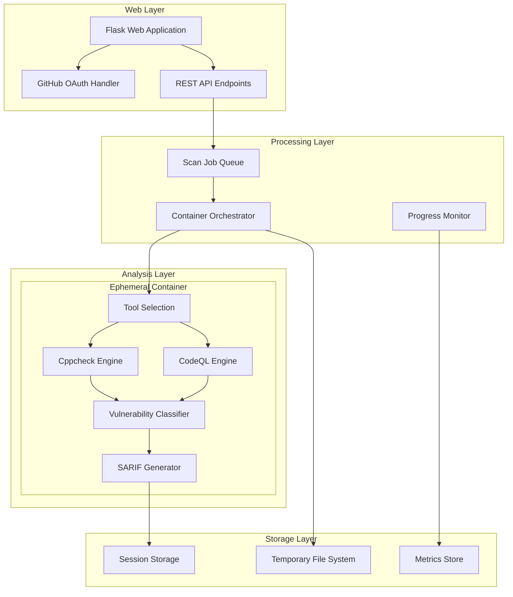

# AutoVulRepair Static Analysis Module - Design Document

## Overview

This design document outlines the technical architecture for Module 1 - Static Analysis of the AutoVulRepair system. The module provides a Flask-based web application that performs static code analysis on C/C++ codebases using industry-standard tools (Cppcheck and CodeQL) in ephemeral, containerized environments. The system supports both authenticated GitHub users and anonymous scanning while maintaining strict privacy controls through ephemeral processing.

## Architecture

### High-Level Architecture



### Component Architecture

#### 1. Flask Web Application Layer
- **Home Controller**: Renders landing page with authentication options
- **Authentication Controller**: Handles GitHub OAuth flow and session management
- **Scan Controller**: Manages scan submission and progress tracking
- **Results Controller**: Displays vulnerability reports and SARIF downloads

#### 2. Code Intake Processing
- **Repository Cloner**: Handles GitHub URL validation and git cloning
- **File Upload Handler**: Processes ZIP file uploads with security validation
- **Code Snippet Processor**: Manages direct code input and temporary file creation
- **Input Validator**: Ensures file size limits, format validation, and malicious content detection

#### 3. Container Orchestration System
- **Docker Manager**: Creates and manages isolated analysis containers
- **Resource Controller**: Enforces CPU/memory limits and timeout policies
- **Cleanup Service**: Ensures automatic container destruction and file cleanup
- **Queue Manager**: Handles concurrent scan job scheduling and prioritization

#### 4. Static Analysis Engines
- **Tool Selection Interface**: Allows users to choose between Cppcheck or CodeQL for analysis
- **Cppcheck Integration**: Configures security-focused rule sets and executes C/C++ scans
- **CodeQL Integration**: Manages language detection and security query execution for multi-language support
- **Result Processor**: Processes findings from selected tool into unified format
- **Confidence Scorer**: Evaluates finding reliability and assigns confidence levels

#### 5. Vulnerability Processing Pipeline
- **Classification Engine**: Labels vulnerabilities by type and CWE mapping
- **Severity Calculator**: Applies CVSS-based scoring for priority ranking
- **Deduplication Service**: Removes duplicate findings based on location and type
- **SARIF Generator**: Creates standards-compliant vulnerability reports

## Components and Interfaces

### Web Application Components

#### Flask Application Structure
```python
app/
├── __init__.py              # Flask app factory
├── auth/                    # Authentication module
│   ├── routes.py           # OAuth routes
│   └── models.py           # User session models
├── scan/                    # Scanning module
│   ├── routes.py           # Scan submission/results routes
│   ├── intake.py           # Code intake handlers
│   └── progress.py         # Real-time progress tracking
├── api/                     # REST API endpoints
│   ├── scan_status.py      # Scan progress API
│   └── results.py          # Results retrieval API
└── static/                  # Frontend assets
    ├── css/
    ├── js/
    └── templates/
```

#### Key Interface Definitions

**Scan Submission Interface**
```python
@dataclass
class ScanRequest:
    scan_id: str
    input_type: str  # 'github_url', 'zip_upload', 'code_snippet'
    content: Union[str, bytes]  # URL, file data, or code text
    analysis_tool: str  # 'cppcheck' or 'codeql'
    user_id: Optional[str] = None
    session_id: str = None
```

**Vulnerability Finding Interface**
```python
@dataclass
class VulnerabilityFinding:
    file_path: str
    function_name: str
    line_number: int
    rule_id: str
    severity: str  # 'critical', 'high', 'medium', 'low'
    confidence: str  # 'high', 'medium', 'low'
    message: str
    cwe_id: Optional[str] = None
    tool_name: str  # 'cppcheck', 'codeql'
```

### Container Analysis Components

#### Docker Container Specification
```dockerfile
FROM ubuntu:22.04

# Install static analysis tools
RUN apt-get update && apt-get install -y \
    cppcheck \
    git \
    build-essential \
    python3 \
    python3-pip

# Install CodeQL CLI
RUN wget -O codeql.tar.gz https://github.com/github/codeql-cli-binaries/releases/latest/download/codeql-linux64.tar.gz \
    && tar -xzf codeql.tar.gz \
    && mv codeql /opt/codeql

# Security hardening
RUN useradd -m -s /bin/bash scanner
USER scanner
WORKDIR /tmp/scan

# Analysis entrypoint
COPY analysis_runner.py /opt/
ENTRYPOINT ["python3", "/opt/analysis_runner.py"]
```

#### Analysis Runner Interface
```python
class AnalysisRunner:
    def __init__(self, scan_config: ScanConfig):
        self.scan_id = scan_config.scan_id
        self.code_path = scan_config.code_path
        self.selected_tool = scan_config.analysis_tool  # 'cppcheck' or 'codeql'
        
    def execute_selected_tool(self) -> List[VulnerabilityFinding]:
        """Execute the user-selected analysis tool"""
        if self.selected_tool == 'cppcheck':
            return self.execute_cppcheck()
        elif self.selected_tool == 'codeql':
            return self.execute_codeql()
        else:
            raise ValueError(f"Unsupported tool: {self.selected_tool}")
        
    def execute_cppcheck(self) -> List[VulnerabilityFinding]:
        """Execute Cppcheck with security-focused rules for C/C++"""
        
    def execute_codeql(self) -> List[VulnerabilityFinding]:
        """Execute CodeQL with appropriate language queries"""
        
    def generate_sarif(self, findings: List[VulnerabilityFinding]) -> dict:
        """Generate SARIF 2.1.0 compliant report from selected tool"""
```

### Queue and Orchestration Components

#### Scan Job Queue
```python
@dataclass
class ScanJob:
    scan_id: str
    priority: int  # Higher number = higher priority
    created_at: datetime
    timeout_seconds: int = 900  # 15 minutes
    resource_limits: ResourceLimits = None
    
class ScanQueue:
    def enqueue(self, job: ScanJob) -> None:
        """Add scan job to priority queue"""
        
    def dequeue(self) -> Optional[ScanJob]:
        """Get next job for processing"""
        
    def get_position(self, scan_id: str) -> int:
        """Get queue position for scan ID"""
```

#### Container Orchestrator
```python
class ContainerOrchestrator:
    def __init__(self, docker_client: docker.DockerClient):
        self.docker = docker_client
        self.active_containers = {}
        
    def create_analysis_container(self, job: ScanJob) -> str:
        """Create isolated container for analysis"""
        
    def monitor_container(self, container_id: str) -> ScanProgress:
        """Monitor container execution and resource usage"""
        
    def cleanup_container(self, container_id: str) -> None:
        """Force cleanup of container and temporary files"""
```

## Data Models

### Database Schema (Session Storage)

```sql
-- Session-based scan tracking (in-memory/Redis)
CREATE TABLE scan_sessions (
    scan_id VARCHAR(36) PRIMARY KEY,
    session_id VARCHAR(64) NOT NULL,
    user_id VARCHAR(64) NULL,
    status VARCHAR(20) NOT NULL, -- 'queued', 'running', 'completed', 'failed'
    input_type VARCHAR(20) NOT NULL,
    created_at TIMESTAMP DEFAULT CURRENT_TIMESTAMP,
    completed_at TIMESTAMP NULL,
    expires_at TIMESTAMP NOT NULL,
    INDEX idx_session_id (session_id),
    INDEX idx_expires_at (expires_at)
);

-- Scan results (ephemeral, session-scoped)
CREATE TABLE scan_results (
    scan_id VARCHAR(36) PRIMARY KEY,
    sarif_report JSON NOT NULL,
    vulnerability_count INT NOT NULL,
    severity_breakdown JSON NOT NULL, -- {'critical': 2, 'high': 5, ...}
    tool_metadata JSON NOT NULL,
    FOREIGN KEY (scan_id) REFERENCES scan_sessions(scan_id)
);
```

### Configuration Models

```python
@dataclass
class AnalysisConfig:
    cppcheck_enabled: bool = True
    codeql_enabled: bool = True
    max_scan_time_minutes: int = 15
    max_file_size_mb: int = 100
    supported_extensions: List[str] = field(default_factory=lambda: ['.c', '.cpp', '.cc', '.h', '.hpp'])
    
@dataclass
class SecurityConfig:
    container_memory_limit: str = "2g"
    container_cpu_limit: str = "1.0"
    network_disabled: bool = True
    readonly_filesystem: bool = True
    temp_dir_cleanup_seconds: int = 60
```

## Error Handling

### Error Classification System

```python
class ScanError(Exception):
    def __init__(self, error_code: str, message: str, details: dict = None):
        self.error_code = error_code
        self.message = message
        self.details = details or {}

# Error code categories
ERROR_CODES = {
    'INPUT_VALIDATION': {
        'INVALID_URL': 'GitHub URL format is invalid',
        'FILE_TOO_LARGE': 'Uploaded file exceeds size limit',
        'UNSUPPORTED_FORMAT': 'File format not supported for analysis'
    },
    'PROCESSING': {
        'CLONE_FAILED': 'Failed to clone repository',
        'CONTAINER_TIMEOUT': 'Analysis container exceeded time limit',
        'TOOL_EXECUTION_FAILED': 'Static analysis tool execution failed'
    },
    'SYSTEM': {
        'RESOURCE_EXHAUSTED': 'System resources temporarily unavailable',
        'INTERNAL_ERROR': 'Internal system error occurred'
    }
}
```

### Error Recovery Strategies

1. **Transient Failures**: Automatic retry with exponential backoff (up to 3 attempts)
2. **Resource Exhaustion**: Queue management with estimated wait times
3. **Tool Failures**: Graceful degradation (partial results from available tools)
4. **Container Failures**: Immediate cleanup and user notification

## Testing Strategy

### Unit Testing Approach

```python
# Test structure
tests/
├── unit/
│   ├── test_intake_handlers.py      # Code intake validation
│   ├── test_analysis_engines.py     # Static analysis tool integration
│   ├── test_sarif_generation.py     # SARIF report generation
│   └── test_container_orchestration.py  # Container management
├── integration/
│   ├── test_scan_workflow.py        # End-to-end scan process
│   ├── test_web_interface.py        # Flask application endpoints
│   └── test_error_handling.py       # Error scenarios
└── fixtures/
    ├── sample_cpp_code/              # Test C++ projects
    ├── expected_sarif_reports/       # Expected analysis outputs
    └── malicious_samples/            # Security test cases
```

### Test Coverage Requirements

- **Unit Tests**: 90% code coverage for core analysis logic
- **Integration Tests**: Complete workflow validation with real tools
- **Security Tests**: Malicious input handling and container isolation
- **Performance Tests**: Concurrent scan handling and resource limits
- **Privacy Tests**: Verification of ephemeral processing and cleanup

### Continuous Testing Pipeline

```yaml
# GitHub Actions workflow
name: Static Analysis Module Tests
on: [push, pull_request]

jobs:
  unit-tests:
    runs-on: ubuntu-latest
    steps:
      - uses: actions/checkout@v3
      - name: Setup Python
        uses: actions/setup-python@v4
        with:
          python-version: '3.11'
      - name: Install dependencies
        run: pip install -r requirements-test.txt
      - name: Run unit tests
        run: pytest tests/unit/ --cov=app --cov-report=xml
      
  integration-tests:
    runs-on: ubuntu-latest
    services:
      docker:
        image: docker:dind
    steps:
      - uses: actions/checkout@v3
      - name: Build analysis container
        run: docker build -t autovulrepair-analyzer .
      - name: Run integration tests
        run: pytest tests/integration/ --docker-image=autovulrepair-analyzer
```

## Implementation Phases

### Phase 1: Core Infrastructure (Weeks 1-2)
- Flask application setup with basic routing
- GitHub OAuth integration
- Session management and basic UI
- Docker container base image creation

### Phase 2: Static Analysis Integration (Weeks 3-4)
- Cppcheck integration and configuration
- CodeQL setup and language detection
- Basic SARIF report generation
- Container orchestration system

### Phase 3: Web Interface and UX (Weeks 5-6)
- Complete web interface implementation
- Real-time progress tracking
- Error handling and user feedback
- Anonymous scanning capabilities

### Phase 4: Security and Privacy (Weeks 7-8)
- Ephemeral processing implementation
- Container security hardening
- Input validation and sanitization
- Privacy controls and cleanup verification

### Phase 5: Performance and Monitoring (Weeks 9-10)
- Concurrent scan handling
- Resource management and scaling
- Metrics collection integration
- Performance optimization and testing

This design provides a comprehensive foundation for implementing the Static Analysis module while maintaining focus on security, privacy, and scalability requirements.